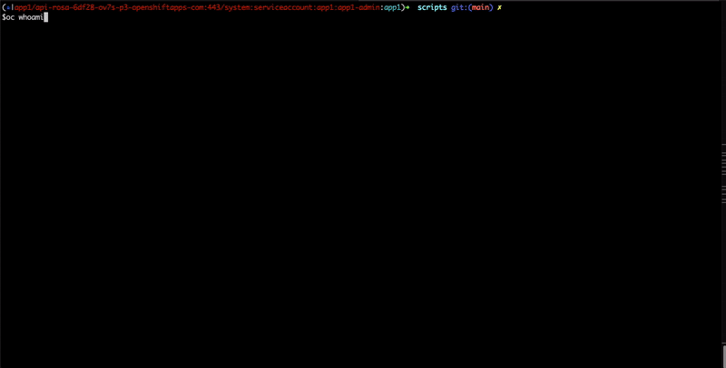

# OpenShift Secure Debugger Solution

## Overview

This solution enables application teams to perform advanced network debugging (e.g., tcpdump, ncat, ip, ifconfig) on OpenShift nodes and pods **without requiring cluster-admin or privileged SCC access**. It uses a secure, auditable workflow with tightly scoped RBAC and a privileged service account in a dedicated namespace.

- **App users** (e.g., `app1-admin` ServiceAccount) can launch debug jobs via a wrapper script.
- **Privileged operations** are performed by a dedicated `debugger-sa` ServiceAccount in the `debugger` namespace, which is bound to a privileged SCC.
- **RBAC** ensures app users have only the minimum permissions required to launch and monitor debug jobs.
- **Gatekeeper Policy:** A Gatekeeper policy is enforced in the `debugger` namespace to prevent app users from deploying any container images other than the approved debug image. This ensures only trusted debug workloads can run with privileged access.

---

## How It Works

1. **App user runs the wrapper script:**
   - `run-debugger-job.sh` is executed by the app user (e.g., `app1-admin` SA).
   - The script takes parameters for node, pod, namespace, command, and arguments (including capture duration for tcpdump).

2. **A Kubernetes Job is created in the `debugger` namespace:**
   - The Job uses the `debugger-sa` ServiceAccount, which is bound to a privileged SCC (`debugger-privileged-scc`).
   - The Job mounts host paths and runs a script from a ConfigMap (`execute-command-configmap.yaml`).

3. **The debug script executes the requested command:**
   - Supports `tcpdump`, `ncat`, `ip`, and `ifconfig`.
   - Handles network namespace entry, output file management, and logs/audits all actions.

4. **App user can fetch logs and results:**
   - The app user can get logs and results (e.g., pcap files) as permitted by RBAC.

---

## Deployment Instructions

### 1. Prerequisites
- OpenShift 4.x cluster
- `oc` CLI access with cluster-admin


### 2. Deploy the Debugger Namespace and Service Account
```sh
oc create namespace debugger
oc create sa debugger-sa -n debugger
```


### 3. Create a pullsecret for debugger 
redhat-debugger-secret.yml can be found in quay. 
```sh
oc create -f redhat-debugger-secret.yml --namespace=debugger
```

### 4. Apply the Privileged SCC.
```sh
oc adm policy add-scc-to-user privileged -z debugger-sa -n debugger
```

<!-- ```sh
oc apply -f k8s/scc.yaml
``` -->
<!-- 
### 4. Bind the SCC to the Debugger Service Account
```sh
# This is usually handled by the SCC yaml, but verify binding:
oc adm policy add-scc-to-user debugger-privileged-scc system:serviceaccount:debugger:debugger-sa
``` -->


### 5. Deploy the ConfigMap with the Debug Script
```sh
oc apply -f k8s/execute-command-configmap.yaml
```

### 6. Apply RBAC for the Debugger Service Account.  Check RBAC Role to ensure its correct namespace that you assign the role to debugger-sa account

For example, the below is giving debugger-sa account admin role to altiplano namespace. For fttc-ancillary namespace, it needs to be updated to namesapce: fttc-ancillary
```
---
apiVersion: rbac.authorization.k8s.io/v1
kind: RoleBinding
metadata:
  name: debugger-sa-binding-altiplanoadmin
  namespace: altiplano
subjects:
- kind: ServiceAccount
  name: debugger-sa
  namespace:  debugger
roleRef:
  kind: Role
  name: admin 
  apiGroup: rbac.authorization.k8s.io

```
```sh
oc apply -f k8s/debugger-sa-rbac.yaml
```
---- tested till here ----
### 7. Apply RBAC for the App User Service Account or App users
This role grants application users the necessary permissions to trigger the debug script and perform allowed actions. Update the file with the application team specific namespace.

#### Resources created by this step:
- A Role named **debugger-role-for-appteams** is created in the debugger namespace.
- A RoleBinding assigns the `ad-app-altiplano-operators` group in the `fttc-ancillary` namespace to the **debugger-role-for-appteams** Role.

In production, assign this role to the actual application team users that require debug access.
```sh
oc apply -f k8s/appsteam-admin-debugger-rbac.yaml
```

### 8. Grant the App User Access to the Debugger Namespace
- Ensure the app user (e.g., `ad-app-altiplano-operators`) is granted the roles defined in `appsteam-admin-debugger-rbac.yaml`.

### 9. Enforce Gatekeeper Policy (Optional but Recommended)
- Apply the Gatekeeper policy to restrict which images can be used in the `debugger` namespace:
```sh
oc apply -f k8s/gatekeeper-debugger-image-policy.yaml
```
- This policy ensures only the approved debug image(s) can be used for jobs in the `debugger` namespace, blocking any attempt by app users to run arbitrary images.

---

## Monitoring and Alerting (Prometheus)

This solution provides built-in monitoring and alerting for debug job activity and security events using Prometheus and Alertmanager.

### 1. Deploy Prometheus Monitoring Resources

Apply the provided ServiceMonitor and PrometheusRule:

```sh
oc apply -f monitoring/prometheus-rules.yaml
```

- **ServiceMonitor**: Scrapes metrics from the debugger daemon (or debug jobs) exposing `/metrics` on the `metrics` port.
- **PrometheusRule**: Defines alerts for privilege violations, unauthorized command attempts, daemon downtime, and high job failure rates.

### 2. Example Alerts
- **DebuggerPrivilegeViolation**: Triggered if a user attempts a privileged operation they are not authorized for.
- **DebuggerUnauthorizedCommand**: Triggered if a blocked/unauthorized command is attempted.
- **DebuggerDaemonDown**: Triggered if the debugger daemon is not up for more than 2 minutes.
- **DebuggerHighJobFailureRate**: Triggered if the job failure rate exceeds a threshold.

### 3. Viewing Metrics
- Metrics are exposed on the `/metrics` endpoint of the debugger daemon or debug job pods.
- You can query metrics such as `debugger_privilege_violations_total`, `debugger_unauthorized_commands_total`, and `debugger_job_failures_total` in Prometheus.

### 4. Alerting
- Alerts will appear in Alertmanager and can be routed to email, Slack, or other notification systems as configured in your cluster.

## Pushgateway Integration

The debugger tool integrates with Prometheus Pushgateway to enable real-time monitoring and alerting of debugging operations.

### 1. What is Pushgateway?

Prometheus Pushgateway acts as an intermediary that allows ephemeral jobs (like our debugger jobs) to expose their metrics to Prometheus. Since debugging jobs are short-lived, Pushgateway stores these metrics until Prometheus scrapes them.

### 2. Deploy Pushgateway

Deploy Pushgateway in the same namespace as the debugger tool:

```sh
# Apply the Pushgateway deployment manifest
oc apply -f k8s/pushgateway.yaml
```

The `pushgateway.yaml` file includes:
- Pushgateway Deployment
- Service to expose Pushgateway
- ServiceMonitor for Prometheus integration
- PrometheusRules with alert definitions specific to debugging operations

### 3. Metrics and Alerting Flow

```
┌───────────────────┐     Push Metrics     ┌───────────────────┐     Scrape      ┌───────────────────┐
│                   │                      │                   │                  │                   │
│   Debugger Job    │────────────────────▶│    Pushgateway    │◀────────────────│    Prometheus     │
│  run-debugger-job │                      │                   │                  │                   │
│                   │                      │                   │                  │                   │
└───────────────────┘                      └───────────────────┘                  └─────────┬─────────┘
         │                                                                                  │
         │                                                                                  │
         │                                                                                  │
         │                                                                                  │ Fire Alerts
         │                                                                                  │
         │         ┌───────────────────┐                                          ┌─────────▼─────────┐
         │         │                   │          Create Tickets                  │                   │
         │         │    ServiceNow     │◀─────────────────────────────────────────│   AlertManager    │
         └────────▶│    (Incidents)    │                                          │                   │
    Job status     │                   │                                          │                   │
    information    └───────────────────┘                                          └───────────────────┘
```

### 4. Metrics Captured

The debug jobs automatically push these metrics to Pushgateway:

- **debugger_job_started_total**: Counter of started debugging jobs
- **debugger_job_completed_total**: Counter of successfully completed jobs
- **debugger_job_failed_total**: Counter of failed debugging jobs
- **debugger_job_status**: Status indicator (1=success, 0=running, -1=failed)
- **debugger_job_duration_seconds**: Duration of job execution
- **debugger_pcap_files_generated_total**: Number of PCAP files generated by tcpdump jobs

### 5. Alert Rules

The Pushgateway deployment includes several alert rules that notify administrators about debugging activities:

- **DebuggerJobCreated**: Notifies when a debugging job starts
- **DebuggerJobCompleted**: Notifies when a job completes successfully
- **DebuggerJobFailed**: Notifies when a job fails
- **DebuggerJobLongRunning**: Alerts on jobs running longer than expected (>10 minutes)
- **DebuggerPcapGenerated**: Tracks PCAP file generation
- **DebuggerTcpdumpNoPcap**: Alerts when tcpdump jobs don't generate expected files

### 6. ServiceNow Integration

Alerts generated by Prometheus are sent to ServiceNow via AlertManager, creating tickets that can be tracked and managed through the ServiceNow interface.

### 7. Troubleshooting Pushgateway

```bash
# Check Pushgateway logs
oc logs deployment/pushgateway -n debugger

# Check if metrics exist in Pushgateway
oc exec $(oc get pod -l app=pushgateway -n debugger -o name | head -1) -n debugger -- curl http://localhost:9091/metrics | grep debugger_

# Test direct push to Pushgateway
oc exec $(oc get pod -l app=pushgateway -n debugger -o name | head -1) -n debugger -- sh -c "echo 'test_metric 1' | curl --data-binary @- http://localhost:9091/metrics/job/test"
```

For more detailed information, refer to the [Pushgateway Integration Guide](docs/PUSHGATEWAY_INTEGRATION.md).

---

## Usage Example

### Launch a Debug Job (as app user)
```sh
./run-debugger-job.sh <node-name> <pod-name> <pod-namespace> tcpdump 60
# Example:
./run-debugger-job.sh worker-node-1 my-app-pod app1 tcpdump 60
```
- This will capture traffic for 60 seconds in the pod's network namespace.

### Supported Commands
- `tcpdump [args] <duration>`
- `ncat [args]`
- `ip [args]`
- `ifconfig [args]`
- `netstat [args]`

### Fetch Logs and Results
```sh
# Get job logs
kubectl logs <debugger-job-pod> -n debugger

# Download pcap files (if generated)
ls ./pcap-dump-*
```

---

## Security Model
- **App users** have only the minimum RBAC required to launch and monitor debug jobs in the `debugger` namespace.
- **Privileged operations** (host access, network namespace entry) are performed only by `debugger-sa` with a privileged SCC.
- **Gatekeeper policy** prevents app users from deploying unapproved images in the `debugger` namespace.
- **All actions are auditable** via Kubernetes events and logs.

---

## Demo

Below is a demo of the solution in action:



---

## References
- `run-debugger-job.sh` (wrapper script)
- `k8s/execute-command-configmap.yaml` (debug script ConfigMap)
- `k8s/rbac.yaml` (RBAC for debugger-sa)
- `k8s/app1-admin-sa.yaml` (RBAC for app user)
- `k8s/scc.yaml` (privileged SCC)


## Release 1.0 : Monitoring update

Alerting and monitoring has been added in this release using pushgateway and alert manager.
More information on Pushgateway is mentioned above. To deploy the latest release, follow the steps below.

### Deploy pushgateway

```sh
oc apply -f k8s/pushgateway
```

The `pushgateway.yaml` file includes:
- Pushgateway Deployment
- Service to expose Pushgateway
- ServiceMonitor for Prometheus integration
- PrometheusRules with alert definitions specific to debugging operations
  
### Update the execute-command-configmap which has the debug script

```sh
oc apply -f k8s/execute-command-configmap.yaml
```

### Update the debugger-sa rbac to get, list pushgateway service details

```sh
oc apply -f k8s/debugger-sa-rbac.yaml
```

### start using the updated run-debugger-job.sh script

```sh
./run-debugger-job.sh <node-name> <pod-name> <pod-namespace> tcpdump 60
# Example:
./run-debugger-job.sh worker-node-1 my-app-pod app1 tcpdump 60
```

if the solution is working - the logs should show something like below

```log
DEBUG: Pushing metric debugger_job_started_total with value 1
DEBUG: URL: http://172.30.106.126:9091/metrics/job/debugger-job/user/rakeshkumarmallam/command/tcpdump
SUCCESS: Pushed metric debugger_job_started_total to Pushgateway
```