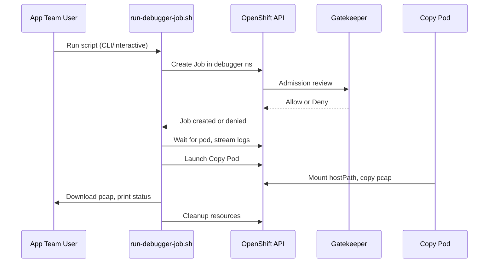

# Secure OpenShift Network Debugging for Application Teams

## Overview

This solution enables application teams (who are only namespace admins for their own namespaces, e.g., `app1`) to run privileged network debugging tools (like `tcpdump`, `ncat`, `ip`, `ifconfig`) on OpenShift nodes, without compromising cluster security. All privileged operations are isolated in a dedicated `debugger` namespace, with strict RBAC, Security Context Constraints (SCC), and Gatekeeper policies.

---

## Architecture Diagram

```mermaid
flowchart TD
    subgraph Application Namespace (app1)
      User1[App Team User<br/>(namespace admin)]
    end

    subgraph Debugger Namespace
      Script[run-debugger-job.sh]
      Job[Privileged Job<br/>(support-tools image)]
      CopyPod[Copy Pod]
      Gatekeeper[Gatekeeper<br/>Policies]
      RBAC[RBAC<br/>Minimal Access]
      SCC[SCC<br/>Privileged for debugger-sa]
    end

    User1 -- runs --> Script
    Script -- creates --> Job
    Script -- monitors --> Job
    Script -- launches --> CopyPod
    Job -- outputs --> CopyPod
    CopyPod -- pcaps --> Script
    Job -- checked by --> Gatekeeper
    Job -- checked by --> RBAC
    Job -- checked by --> SCC
    CopyPod -- checked by --> Gatekeeper
    CopyPod -- checked by --> RBAC
    CopyPod -- checked by --> SCC
```

---

## Workflow

1. **User Experience**
    - Application team user runs `run-debugger-job.sh` (CLI or interactive).
    - Script prompts for node, pod, namespace, command, and arguments.
    - Script generates a Job YAML and applies it in the `debugger` namespace.

2. **Job Creation & Security**
    - The Job uses a platform-team-maintained, pre-approved image (`support-tools`).
    - The Job runs as privileged, with host networking and hostPath mounts, but only in the `debugger` namespace.
    - The Job is labeled with the user and timestamp for auditability.

3. **Policy Enforcement**
    - **RBAC:** User has minimal permissions in `debugger` (create/delete Jobs, get logs, etc.).
    - **SCC:** Only the `debugger-sa` ServiceAccount can run privileged pods in `debugger`.
    - **Gatekeeper:** 
        - Only the approved image is allowed.
        - Only specific commands (`tcpdump`, `ncat`, `ip`, `ifconfig`) are allowed as entrypoints.

4. **Execution & Output**
    - Script waits for Job scheduling, checks for Gatekeeper denials, and prints clear error messages if denied.
    - If allowed, script streams logs and waits for completion.
    - Script launches a copy pod to retrieve pcap files from the node.
    - Script cleans up all resources after completion.

---

## Security Model

- **Least Privilege:** App team users have no cluster-admin or privileged access in their own namespaces.
- **Isolation:** All privileged operations are isolated in the `debugger` namespace.
- **Image Control:** Only the platform team can update the debugging image.
- **Command Control:** Only approved commands are allowed via Gatekeeper.
- **Auditability:** All jobs are labeled and logs are available for review.

---

## Example: RBAC and Gatekeeper Policy

**RBAC Role (debugger namespace):**
```yaml
apiVersion: rbac.authorization.k8s.io/v1
kind: Role
metadata:
  namespace: debugger
  name: app1-debugger-role
rules:
- apiGroups: ["batch", ""]
  resources: ["jobs", "pods"]
  verbs: ["create", "get", "list", "delete", "watch"]
- apiGroups: [""]
  resources: ["pods/log", "pods/exec"]
  verbs: ["get", "list"]
```

**Gatekeeper Constraint (only allow support-tools image):**
```yaml
apiVersion: constraints.gatekeeper.sh/v1beta1
kind: K8sAllowedRepos
metadata:
  name: only-support-tools
spec:
  repos:
    - "registry.redhat.io/rhel8/support-tools:8.10-15.1749683615"
```

**Gatekeeper Constraint (only allow specific commands):**
```yaml
apiVersion: constraints.gatekeeper.sh/v1beta1
kind: K8sAllowedDebugCommands
metadata:
  name: only-approved-debug-commands
spec:
  allowedCommands:
    - "/opt/scripts/execute-command.sh"
  allowedArgs:
    - "tcpdump"
    - "ncat"
    - "ip"
    - "ifconfig"
```

---

## Sequence Diagram



---

## Summary

- **Privileged debugging** is possible for app teams without cluster-admin access.
- **Security is enforced** at every layer: RBAC, SCC, Gatekeeper.
- **Platform team controls** the image and allowed commands.
- **User experience is simple** and safe, with clear feedback and automated cleanup.

---

*For further details, see the script and policy YAMLs in the repository.*
